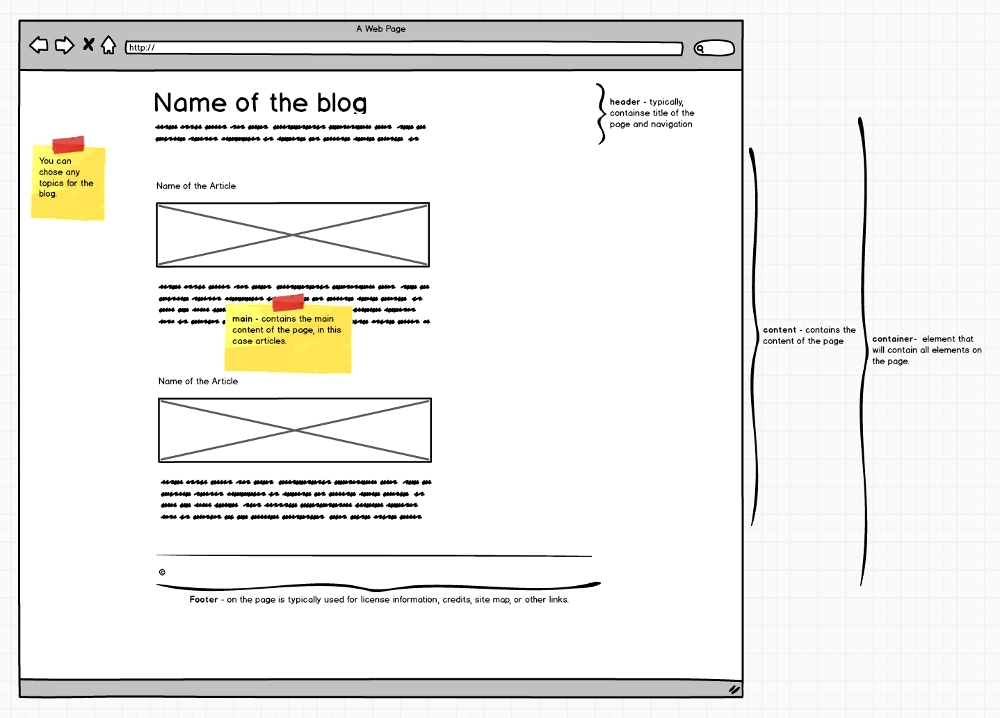
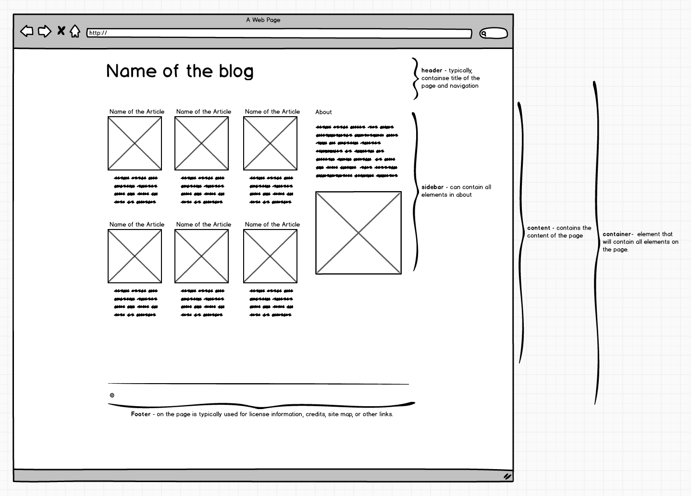

# HTML/CSS Project

First step is to fork this repo into your own Github account - if you don't remember how, then refer back Lesson 0 contents.

## For Week 1

Create a new webpage on a subject that you're interested in (maybe the same topic you used for your Codepen submission). The page should **NOT** use any framework like Bootstrap and it should include the following elements:
  - The `.html` page and a linked `.css` file applies a consistent color scheme to links and text on your page.
  - A page header with a title and description for the site.
  - An articles section with three articles, each including a title, summary and a link.
  - A page footer containing info about you or the site.
  - Proper use of the semantic HTML tags we discussed.
  - Research the `:first-child` pseudo-class and use it to style the first article so that it stands out from the others.
  - Use this website [Lorem Ipsum](http://www.lipsum.com/) to generate random blocks of contents to fill your website.
  - **Commit often (with good meaningful commit messages), and Push to Github regularly.**
  - Use the sketch below to guide you towards the layout and content you are trying to achieve. *Please note that this is just a sketch - you can choose the colours, fonts and images that you want to use in the page.*

  
  

## For Week 2

Revisit the webpage you created in last week's homework assignment. Add a sidebar to your site and move the site description into it. This should appear below the articles on small screens, then switch to a two-column layout with the articles and sidebar sitting side-by-side. Add at least three more articles and then convert them to a grid, so that you show 3 articles per row in a box layout.

- Research mobile-first, how would your HTML/CSS have been different if you followed a mobile-first approach?

  

## For Week 3
  - Explore how we name our classes and elements
  - Create a new Branch called bootstrap-site, and use a framework to implement the same site and compare
  (Learn about Branching here - https://guides.github.com/introduction/flow/)
