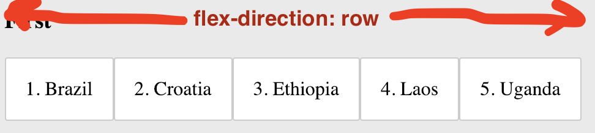
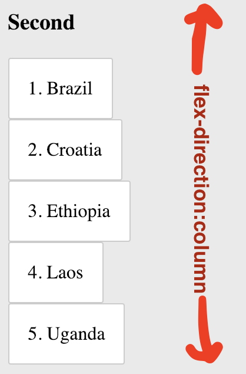

# Flexbox

Flexbox is used to change the layout of elements on the HTML page. In this exercise, you'll apply the `flex-direction` property to change how the countries are displayed. Follow the steps below to complete this exercise.

1. Open `flexbox.css` and write a CSS rule to apply `display: flex` to the "container" element. _Hint: The "container" element will be the parent element of each country.
2. Look at the First list of countries. Then look at the First Result displayed to the side. Find the differences between the two lists.
3. Use the property `flex-direction` to make the countries on the left look like the ones on the right

_Hint: You can review how `flex-direction` works in [this guide](https://css-tricks.com/snippets/css/a-guide-to-flexbox/#article-header-id-3)._

Next, study below two images. 

For now, try to imagine `flex-direction` as the red arrow, that is either horizontal (when `flex-direction: row`) or vertical (when `flex-direction: column`):
