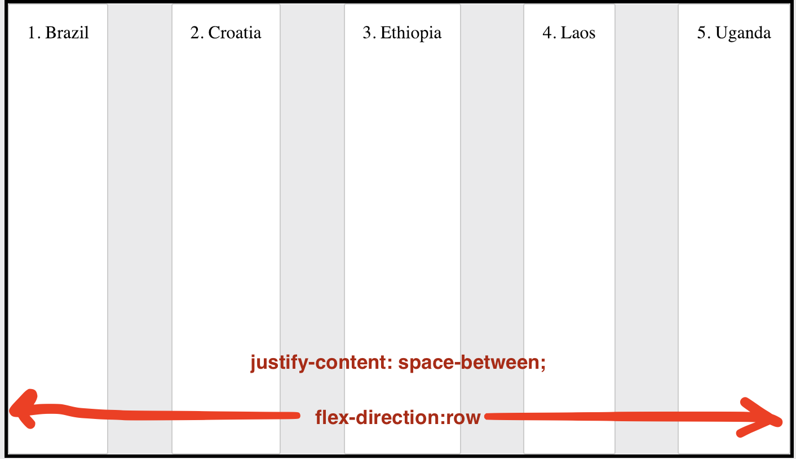
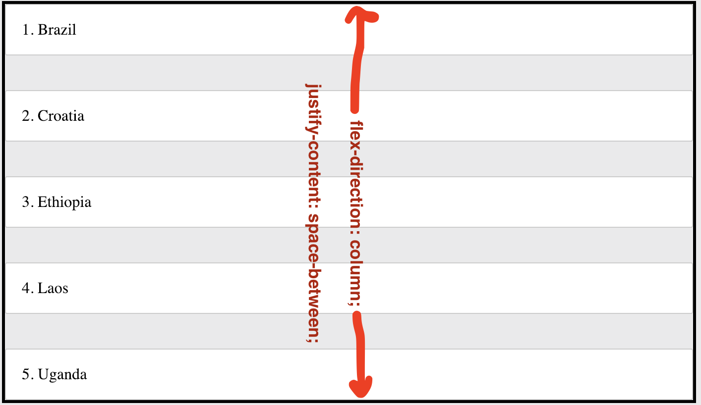

# Justify Content

With flexbox, the `justify-content` property can be used to control how extra space is used. In this exercise, you'll apply a different `justify-content` property to each list. Follow the steps below to complete this exercise.

1. Look at the First list of countries. Then look at the First Result displayed in the "Solutions" panel. Find the differences between the two lists.
2. Use `justify-content` and `flex-direction` to make the list of countries on the left look like "Solutions" one.

_Hint: You can review how `justify-content` works in [this guide](https://css-tricks.com/snippets/css/a-guide-to-flexbox/#article-header-id-6)._

Now, also study below two images. 

In both of them, `justify-content` has the value `space-between`.
However, in the first picture, `justify-content` arranges them horizontally. And in the second one, vertically.

So, `justify-content` works in the same direction as the **red arrow** (`flex-direction`).
