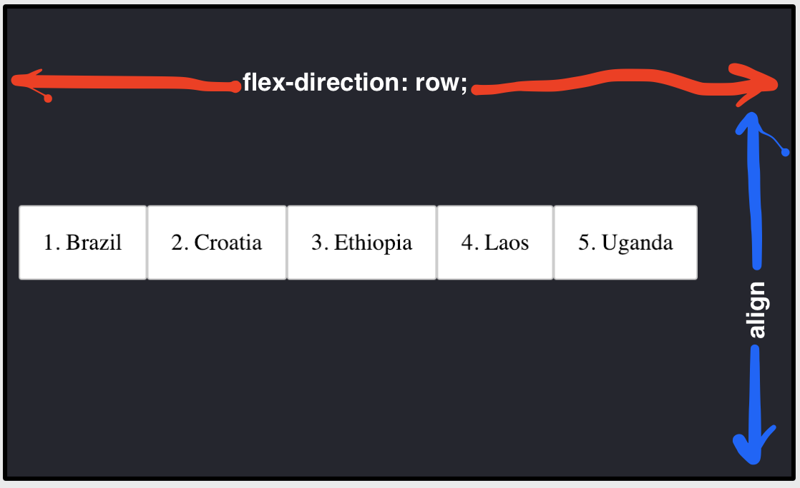
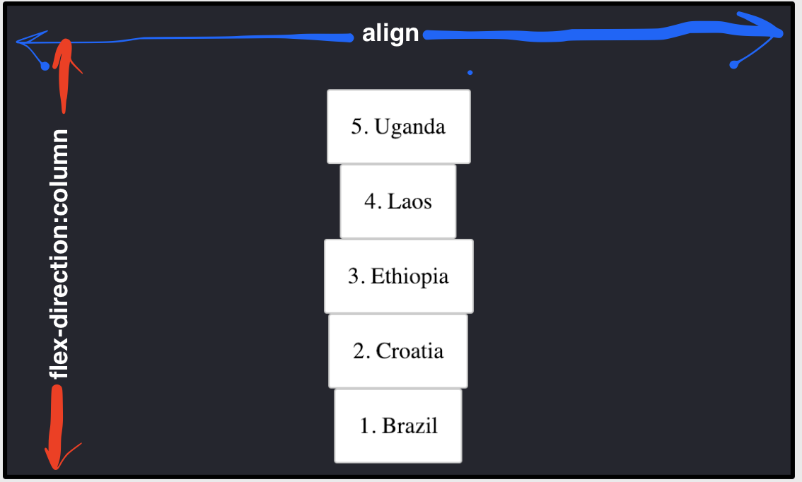

# Align Items

With flexbox, the `align-items` property can be used to control how the items are positioned inside of the container. In this exercise, you'll apply a different `align-items` property to each list. Follow the steps below to complete this exercise.

1. Look at the First list of countries. Then look at the First Result displayed in the "Solutions" panel. Find the differences between the two lists.
2. Use `align-items` and `flex-direction` to make the list of countries on the left look like "Solutions" one.

_Hint: You can review how `align-items` works in [this guide](https://css-tricks.com/snippets/css/a-guide-to-flexbox/#article-header-id-7)._

Study the below two images. 

In both of them, `align-items` has the value `center`.
However, in the first picture, `align-items` arranges them vertically. And in the second one, horizontally.

So, **aligning** items in Flexbox (blue arrow) works opposite to the **red arrow** (`flex-direction`).
