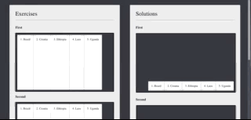
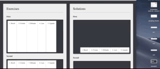

# Item order

You know what to do by now - see if you can solve as many of the exercises in here!

###Bonus exercise:

The exercise page currently has a problem. If you have a very small screen, both the exercises and the solutions will be very squished:

But today we also learned about `media-queries`. 

Add code in `flexbox.css` so that when the screen is smaller than `1240px` the containers display like in the below example:

